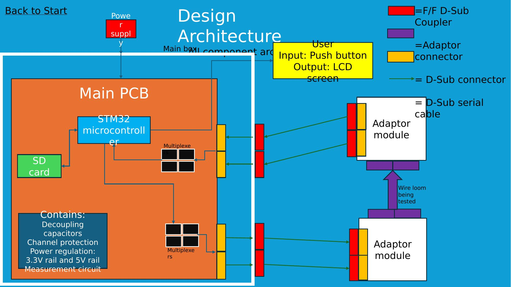
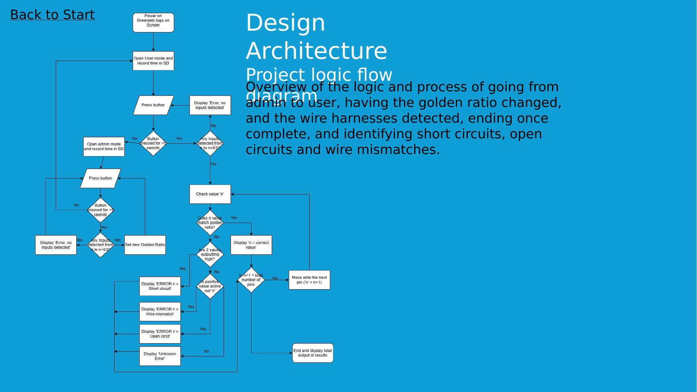
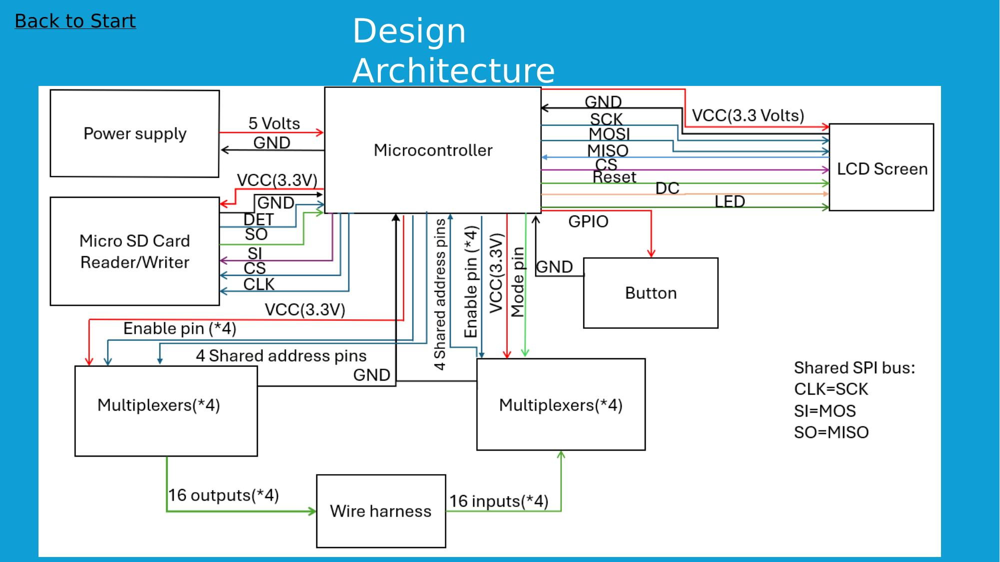

# Design Architecture

## Design Evolution

**Initial idea:** Store multiple harness types on an SD card, load the relevant one into RAM, and compare it against the connected harness, navigated via a scroll-wheel menu (new harness / test / view results). Rejected — only one "golden sample" is needed at a time, and this added test time and complexity without being user friendly.

**Input method thinking:** The goal was a single button for most users, with a touch-screen password for admins to change the golden sample. Since a separate touch-input screen would undermine the simplicity goal, the team settled on using the same button for everything.

## Final Design

A single button provides all input.

- **Normal use:** connect harness → press button → test runs → result + timestamp logged to SD → result shown on screen.
- **Admin mode:** hold the button 5 seconds to enter admin mode (shown via icon/text color change); connecting the golden sample and pressing the button stores it as the new reference. Hold 5 seconds again to exit.
- **Status colors:** Pass = green, Fail = red, Admin = blue.

This keeps the interface simple for everyday users while keeping the golden-sample update path deliberately non-obvious, and all results (with timestamps) are recoverable by plugging the SD card into a PC.

## Component Architecture

The main box houses the Main PCB (STM32 microcontroller, multiplexers, SD card, decoupling capacitors, channel protection, and power regulation providing 3.3 V and 5 V rails) plus the push-button input and LCD output. Two adaptor modules connect through D-Sub couplers and cabling to the wire loom under test.

## Operating Process

On power-up, the ESP32 boots, initializes the LCD, SD card, and multiplexers, then loads the most recent golden sample. In user mode the display reads "Harness tester — Ready — Connect harness." Pressing the button runs the test against the golden sample; a pass shows a green message, a fail shows red with the fail type (short circuit, open circuit, or wire mismatch) and location. Holding the button switches to admin mode (blue text, "Golden loom sample — Ready — Connect harness"), where pressing the button stores a new golden sample to the SD card with a timestamp.

## Logic Flow Diagram

Traces the full logic from power-on through user/admin mode switching, golden-ratio updates, and per-pin harness checking, down to identifying short circuits, open circuits, and wire mismatches, ending with a total results summary.

## Block Diagram

Shows the electrical connections between the power supply, microcontroller, LCD screen, microSD card reader/writer, button, and two sets of multiplexers, including the shared SPI bus (CLK/SI/SO mapped to SCK/MOSI/MISO) and the 16-input/16-output connections to the wire harness under test.
